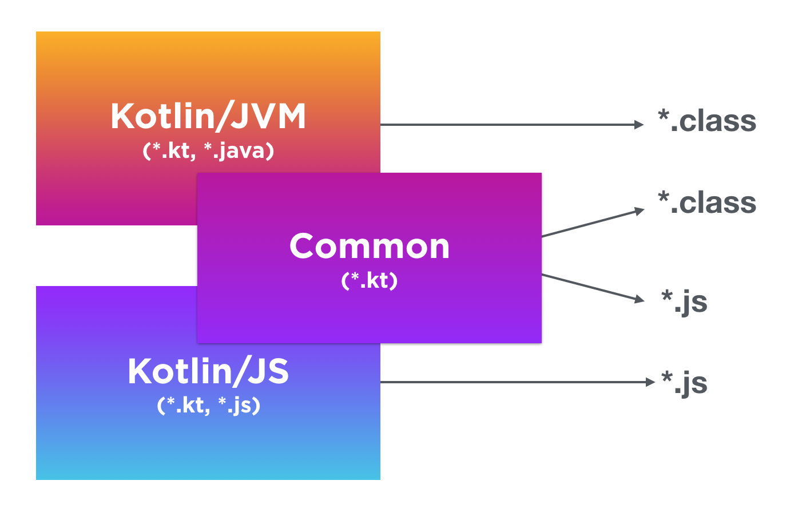

# Kotlin

---

## Kotlin

### Histoire de Kotlin

- Créé par JetBrains (aussi connu pour l'IDE IntelliJ IDEA)
- Annoncé en juillet 2011 (en même temps que Java 7)
  - Premier commit en novembre 2010
  - Release 1.0 en février 2016 (sous Java 8)
  - Open Source sous license Apache 2
- Support total dans Android en 2017
- Devenu langage par défaut de Android en mai 2019

## Kotlin

### Avantages de Kotlin {.example}

- Peut être compilé en bytecode pour JVM (Java 8+)
- Est interopérable avec Java et Scala
  - Fonctionne dans les projets Java
  - Peut utiliser des libraries Java
  - Peut être exporté en librairie pour des projets Java
- Est sûr (pas de `null`) et moins verbeux
- Multiplatforme depuis 1.2 (novembre 2017)
  - Javascript
  - Native Android/iOS/mac/Linux/Windows
  - Web Assembly

## Kotlin Multiplatforme

\center


## Kotlin et Java

### Kotlin et Java {.alert}

- Java a débuté en 1995
- Débuts de Kotlin sous Java 7
  - Sortie de Java 7 en juillet 2011
  - Annonce de Kotlin en juillet 2011
- Première release de Kotlin sous Java 8
  - Sortie de Java 8 mars 2014
  - Sortie de Kotlin 1.0 février 2016
- Utilisation dans Android
  - Android compatible avec des versions précises de Java
  - Kotlin se détache des versions Java

# Les concepts Kotlin

## Les concepts Kotlin

### Principaux concepts

- Programmation Orienté Objet (POO)
- Programmation Fonctionnel (Lambda, fonction anonyme...)
- Typage dynamique
- Immutabilité
- Interopérabilité avec Java
- Null safe

# Écrire du Kotlin

---

## Exemple fonction `main` Java

```java
class HelloWorld {
  // Doit obligatoirement être dans une classe
  public static void main(String[] args) {
    System.out.println("Hello, World!");
  }
}
```

```java
// Preview de Java 21 (Septembre 2023)
// Bientôt dans Java (ETA 2024)
void main() {
  System.out.println("Hello, World!");
}
```

---

## Exemple fonction `main` Kotlin

```kotlin
fun main(args: Array<String>) {
  println("Hello, world!")
}
```

```kotlin
// Depuis Kotlin 1.3 (octobre 2018)
fun main() {
  println("Hello, world!")
}
```

```kotlin
fun main() = println("Hello, world!")
```

---

## Kotlin VS Java

### Les ressemblances {.example}

- La fonction `main`:
  - Est toujours le point d'entrée du programme
  - Prend en argument une liste de `String`
- `println` affiche à l'écran ce qu'il prend en paramètre avec un saut de ligne

### Les différences {.alert}

- En Kotlin:
  - Les arguments de `main` peut être omis
  - Pas besoin de mettre le package `System.out` pour effectuer un print sur l'écran

---

## Exemple variables Java

```java
// Affectation immédiate
int a = 1;
```

```java
// Ajouté depuis Java 10 (Mars 2018)
// Le type `int` est déduit par la valeure
var b = 2;
// Et on peut reassigner une variable `var`
b = a;
```

```java
// On peut déclarer une variable et l'affecter après
int c;
c = 3;
```

## Exemple variables Kotlin

```kotlin
// Affectation immédiate
val a: Int = 1
a = 4 // Erreur: Une valeur ne peut être modifiée
```

```kotlin
// Le type `Int` est déduit par la valeure
var b = 2
// Et on peut reassigner une variable `var`
b = a
```

```kotlin
// Le type est requis quand il n'y a pas
// de valeure d'initialisation
val c: Int
// Première initialisation
c = 3
```

## Kotlin vs Java

### Les différences {.alert}

- En Kotlin
  - Nous avons la notion d'immutabilité grâce aux `val`
  - Le type de la variable se met après le nom de celle-ci
  - Le type de la variable peut être déduite dans la plupart des cas
- Les primitives Java ont une majuscule en Kotlin (`int` devient `Int`)
- La classe Java `Object` devient `Any` en Kotlin

## Example functions Java

```java
public int sum(int a, int b) {
  return a + b;
}
```

```java
int mul(int a, int b) {
  return a * b;
}
```

## Example functions Kotlin

```kotlin
// Le mot clé est `fun` et le type se met à la fin
fun sum(a: Int, b: Int): Int {
  return a + b
}
```

```kotlin
// Le type de retour peut être déduit
internal fun mul(a: Int, b: Int) = a * b
```

## Kotlin vs Java

### Les ressemblances {.example}

- Le mot clé pour les retours de fonction reste `return`

### Les différences {.alert}

- En Kotlin
  - Tout est `public` (fonctions et attributs)
  - Pour les functions simples, on peut mettre un `=` avec le retour
  - Le type de retour se met toujours après les déclarations
  - Les access modifiers sont : `public` (par défault); `internal` (=> rien en Java); `protected`; `private`

## Example conditions if Java

```java
int maxOf(int a, int b) {
  if (a > b) {
    return a;
  } else {
    return b;
  }
}
```

```java
int maxOf(int a, int b) {
  // Opérateur ternaire
  return a > b ? a : b;
}
```

## Example conditions Kotlin

```kotlin
fun maxOf(a: Int, b: Int): Int {
  if (a > b) {
    return a;
  } else {
    return b;
  }
}
```

```kotlin
fun maxOf(a: Int, b: Int): Int {
  return if (a > b) a else b
}
// Équivalent à l'opérateur ternaire
fun maxOf(a: Int, b: Int) = if (a > b) a else b
```

## Kotlin vs Java

### Les ressemblances {.example}

- Le `return` se met dans les cas du `if`

### Les différences {.alert}

- En Kotlin:
  - Le `return` peut se mettre avant le `if`
  - L'opérateur ternaire n'existe pas, c'est un `if`

## Example expressions `switch` Java

```java
// Ancien style switch/case
int switchCase(int x) {
  switch (x) {
    case 1:
    case 3:
      return -1;
    default: return x * 2;
  }
}
```

## Example expressions `switch` Java 12

```java
// Les expression switch/case
// Ajouté depuis Java 12 (Mars 2019)
int switchCase(int x) {
  return switch (x) {
    case 1, 2 -> { yield -1; }
    default   -> x * 2;
  };
}
```

## Example Pattern Matching `switch` Java 21

```java
// Pattern Matching dans le switch/case
// Ajouté depuis Java 21 (Septembre 2023)
String switchCase(Object obj) {
  return switch (obj) {
    case String s -> String.format("String %s", s);
    case Integer i && i >= 0 // restrindre le pattern
        -> String.format("positive int %d", i);
    case Integer i && i < 0
        -> String.format("negative int %d", i);
    default -> obj.toString();
  };
}
```

## Example expressions `when` Kotlin

```kotlin
fun switchCase(x: Int): Int {
  when (x) {
    1, 2 -> return -1
    else -> return x * 2
  }
}
```

```kotlin
fun switchCase(x: Int): Int =
  when (x) {
    1, 2 -> -1
    else -> x * 2
  }
```

## Example expressions `when` Kotlin

```kotlin
fun switchCase(x: Int) =
  when {
    x <= 2 -> -1
    x == 3 -> 0
    else -> x * 2
  }
```

## Example Pattern Matching `when` Kotlin

```kotlin
fun switchCase(o: Any): String =
  when (o) {
    is Int, is Float -> "Number ${o.toString()}"
    is String -> "String ${o.lowercase()}"
    else -> o.toString()
  }
```

## Kotlin vs Java

### Les ressemblances {.example}

- On peut combiner plusieurs options qui retournen la même instruction

### Les différences {.alert}

- Le mot clé pour les expression est différente entre Java et Kotlin, nous avons le `switch` et `when`
- Depuis Java 12 les expressions sont plus semblable à Kotlin
- Possibilité de mettre des conditions plus complexes dans les options en Kotlin
- En Java on utilise `yield` dans les cas complexes, cela determine la valeure de retour du `switch`
- Le pattern matching kotlin ne permet pas de restrindre après une selection de type

## Example boucles `for` Java

```java
List<String> list = Arrays.asList("a", "b", "c", "d");
for (int i = 0; i < list.size(); i++) {
  System.out.println(list.get(i));
}
```

```java
var list = Arrays.asList("a", "b", "c", "d");
for (String elt : list) {
  System.out.println(elt);
}
```

## Example boucles `for` Kotlin

```kotlin
val list = listOf("a", "b", "c", "d")
for (i in 0..list.size - 1) { // Range
  println(list[i])
}
```

```kotlin
val list = listOf("a", "b", "c", "d")
for (elt in list) {
  println(elt)
}
```

```kotlin
val list = listOf("a", "b", "c", "d")
for (i in list.size - 1 downTo 0 step 2) { // Range
  println(list[i])
}
```

## Example boucles `while` et `do/while` Java/Kotlin

```java
var n = 0;
while (n < 0) {
  System.out.println(n);
  n++;
}
```

```java
var n = 0;
do {
  System.out.println(n);
  n++;
} while (n < 0);
```

## Kotlin vs Java

### Les ressemblances {.example}

- Présence de la boucle améliorée pour itérer sur les éléments à l'aide de `:` en Java et `in` en Kotlin
- Code identique pour `while` et `do`/`while`

### Les différences {.alert}

- Création de liste plus simple en Kotlin
- Les `Range` dans Kotlin permettent à la fois de créer des listes de nombres mais également de gérer les conditions d'arrêt des boucles `for`

## Example boucles `forEach` et `map` Java

```java
// Depuis Java 8 (Mars 2014)
var list = Arrays.asList("a", "b", "c", "d")
  .stream()
  .map(elt -> elt + "_" + elt)
  .collect(Collectors.toList());
list.forEach(elt -> System.out.println(elt));
// Equivalent à
list.forEach(System.out::println);
```

```java
// Depuis Java 16 (Mars 2021)
var list = Arrays.asList("a", "b", "c", "d")
  .stream()
  .map(elt -> elt + "_" + elt)
  .toList();
```

## Example boucles `forEach` et `map` Kotlin

```kotlin
val list = listOf("a", "b", "c", "d")
  .map { elt -> elt + "_" + elt }
list.forEach { elt -> println(elt) }
// Equivalent à (où `it` fait référence à
// l'élément de la lambda)
list.forEach { println(it) }
// Et à
list.forEach(::println)
// Présence de
list.forEachIndexed {
  idx, elt -> println("$elt $idx")
}
```

## Kotlin vs Java

### Les ressemblances {.example}

- Les listes initiales resteront inchangées après ces fonctions (immutable)
  - En générale on chaîne les instructions
  - Les objets contenus dans les listes peuvent être modifiés

### Les différences {.alert}

- Utilisation de l'API Stream en Java 8+
  - Très verbeuse, il faut commencer par `stream()` et finir par `collect()`
  - Java essaie de rattraper son retard avec l'ajout de `toList()` en 2021
  - Pas d'équivalent à `forEachIndexed`

## Example POJO avant `record` Java

```java
public class Human {
  private String name;
  private String surname;
  public Human(String name, String surname) {
    this.name = name;
    this.surname = surname;
  }
  public Human(String name) { this.name = name; }
  public String getName() { return name; }
  public String getSurname() { return surname; }
  public String toString() { /* ... */ }
  public int hashcode() { /* ... */ }
  public boolean equals(Object o) { /* ... */ }
}
```

## Example POJO `record` Java

```java
// Depuis Java 14 (Mars 2020)
public record Human(String name, String surname) {
  // Second constructeur
  public Human(String name) {
    this(name, null);
  }
}
```

```java
// Création des objets
var man = new Human("John", "Doe");
var woman = new Human("Jane");
System.out.println(man + " / " + man.name());
// Human[name=John, surname=Doe] / John
System.out.println(woman);
// Human[name=Jane, surname=null]
```

## Example POJO `data class` Kotlin

```kotlin
data class Human(
  val name: String,
  val surname: String
) {
  constructor(name: String) : this(name, "")
}
```

```kotlin
val man = Human("John", "Doe")
val woman = Human("Jane")
println("$man / ${man.name}")
// Human(name=John, surname=Doe) / John
println(woman)
// Human(name=Jane, surname=)
println(woman.copy(surname = "Doe"))
// Human(name=Jane, surname=Doe)
```

## Kotlin vs Java

### Définitions {.example}

- Les POJO (Plain Old Java Object) sont des objets simples, sans règle métiers.
  - Utilisé pour décrire des tables (Java Bean)
  - Utilisé pour du transfert de donnée (DTO: Data Transfert Object).

### Les différences {.alert}

- Java essaie de rattraper son retard avec l'ajout des records en 2020
- Java nécessite toujours l'utilisation d'accolades lors de la déclaration de `record`

# Les exclusivités de Kotlin

## Null safety : Safe Calls

```kotlin
val notNullString: String = "Jamais null"
val nullableString: String? = "Peut être null"
val nullString: String? = null

println(notNullString.lowercase())
// -> "jamais null"
// println(nullableString.lowercase())
// -> ne compile pas
println(nullableString?.lowercase())
// -> "peut être null"
println(nullString?.lowercase())
// -> null
```

## Null safety : Elvis Operator `?:`

```kotlin
val nullableString: String? = "Peut être null"
val nullString: String? = null

println(nullableString ?: "C'était null")
// -> "Peut être null"
println(nullString ?: "C'était null")
// -> "C'était null"
```

## Null safety : Unsafe Call

```kotlin
val nullableString: String? = "Peut être null"
val nullString: String? = null

println(nullableString!!)
// -> "Peut être null"
println(nullString!!)
// -> throw une exception `NullPointerException`
```

## String et templates

```kotlin
val s = "Kotlin"
val n = 2011

println("Le language $s a été créé en $n")

println("""En $s
  on peut
  écrire sur
  plusieurs lignes
  """.trimIndent())
```

## Les extensions

```kotlin
fun String.customExtension(s: String): Int {
  return "$this $s"
}

fun main() {
  println(
    "Test d'une extension".customExtension("Kotlin")
  )
  // -> "Test d'une extension Kotlin"
}
```

## Les opérateurs

```kotlin
data class Wedding(val h1: Human, val h2: Human)
data class Human(
  val name: String,
  val surname: String = ""
) {
  operator fun plus(other: Human) =
    Wedding(this, other)
}
fun main() {
  val wedding = Human("Jonh") + Human("Jane")
  println(wedding)
// Wedding(h1=Human(name=Jonh), h2=Human(name=Jane))
}
```

## Destructurer des objets

```kotlin
for ((key, value) in mapOf("Odin" to 13)) {
  println("$key $value kids")
  // -> "Odin 13 kids"
}

for ((_, surname) in listOf(
  Human("Galileo", "Galilei"))
) {
  println("M.$surname is an astronomer & physicist")
  // M.Galilei is an astronomer & physicist
}
```

## Initialisation `lazy` et `lateinit`

```kotlin
class LazyClass {
  lateinit var first: String
  val second by lazy { Math.random() }
  // val third: String // Do not compile

  fun doSomething() {
    first = "The string initalized"
  }

  fun doSomethingElse() = first.length * second
}
```

## Valeur par défaut et paramètre nommé

```kotlin
data class HugeClass(
  val param1: String = "1",
  val param2: String = "2",
  val param3: String = "3",
)

fun main() {
  println(HugeClass("5"))
  // HugeClass(param1=5, param2=2, param3=3)
  println(HugeClass("6", param3 = "7"))
  // HugeClass(param1=6, param2=2, param3=7)
}
```

## Valeur par défaut et paramètre nommé

```kotlin
data class HugeClass(
  val param1: String = "1",
  val param2: String = "2",
  val param3: String = "3",
)

fun main() {
  println(HugeClass("5"))
  // HugeClass(param1=5, param2=2, param3=3)
  println(HugeClass("6", param3 = "7"))
  // HugeClass(param1=6, param2=2, param3=7)
}
```

## TODO / `NotImplementedError`

```kotlin
fun getOrNull(): Any? =
  TODO("Not Implemented yet!")
// -> throw une exception `NotImplementedError`

fun getOrNull(): Any? = { }
// Ne va pas compiler car le retour ne match pas
```

## Conclusion {.standout}

\centering\Huge Question ?
